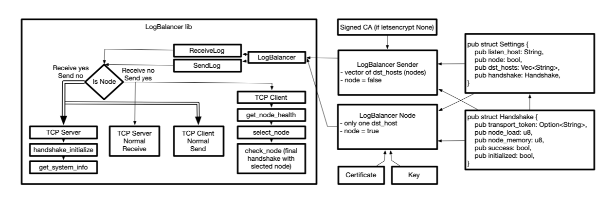

# rust-logbalancer
Logbalancer in rust

Under development



## installation

add to Cargo.toml:
```
[dependencies]
logbalancer = {  git = "https://github.com/lukasbalazik123/rust-logbalancer"  }
```

## usage
### Sender
```
extern crate logbalancer;

use logbalancer::{LogBalancer, Settings};

fn main() {
    // sender key (for receiving from first log server for example syslog-ng)
    let key = String::from("key.pem");
    // sender signed cert (for receiving from first log server for example syslog-ng)
    let certificate = String::from("cert.pem");
    // ca cert (ca from logbalancer node)
    let ca_certificate = String::from("cacert.pem");
    let listen_host = String::from("127.0.0.1:3333");

    let mut dst_hosts = Vec::new();
    dst_hosts.push(String::from("127.0.0.1:3333"));
    dst_hosts.push(String::from("127.0.0.1:3334"));

    let mut logbalancer = LogBalancer {
        settings: Settings::sender_settings(String::from("logbalancer-sender:12345"), dst_hosts),
        transport_token_function: None,
        private_key_file: key,
        certificate_chain_file: certificate,
        ca_file: ca_certificate,
    };
    logbalancer.start();
}
```
### Node
```
extern crate logbalancer;

use logbalancer::{LogBalancer, Settings};

fn main() {
    // node key
    let key = String::from("key.pem");
    // node signed cert
    let certificate = String::from("cert.pem");
    // ca cert (ca from dest logging server for example syslog-ng)
    let ca_certificate = String::from("cacert.pem");
    let listen_host = String::from("127.0.0.1:3333");

    let mut logbalancer = LogBalancer {
        settings: Settings::node_settings(String::from(listen_host), String::from("192.168.0.24:514")),
        transport_token_function: None,
        private_key_file: key,
        certificate_chain_file: certificate,
        ca_file: ca_certificate,
    };
    logbalancer.start();
}
```
